## 구글 클라우드 앱 토큰 생성

> 주의
>
> - 앱 이름에는 'google' 이라는 단어가 들어가면 안됩니다.
>
>   앱 이름에 'google' 이라는 단어가 포함되면 에러를 내기에 아래 예제문서에서는 'analytics-manager' 라는 이름으로 지정해주었습니다.
>
> - 참고 : [앱을 저장하는 중에 오류가 발생했습니다. 요청이 악용으로 분류되었으며 진행할 수 없습니다. 해결 방법](https://happy-jjang-a.tistory.com/288)
>
> - 이번 설명 문서에서는 프로젝트 명에 'google' 이라는 단어를 포함했지만, 나중에 혼동을 방지하고 싶다면 가급적이면 프로젝트 명도 'google' 단어를 포함하지 않는 것을 추천합니다.


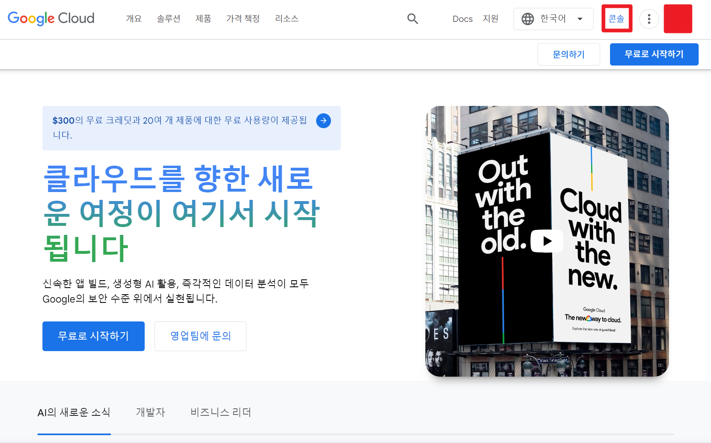

<br/>


<br/>


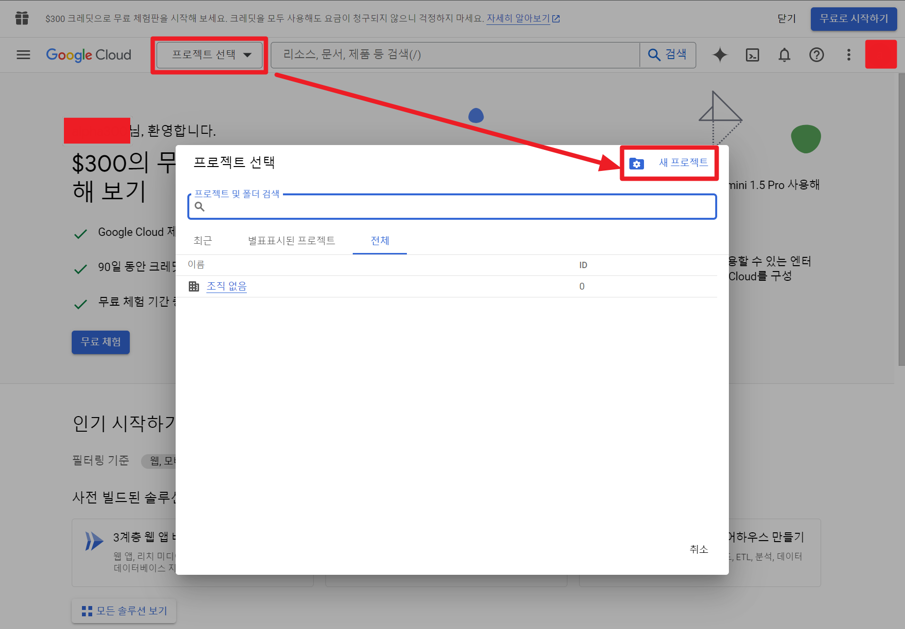

<br/>


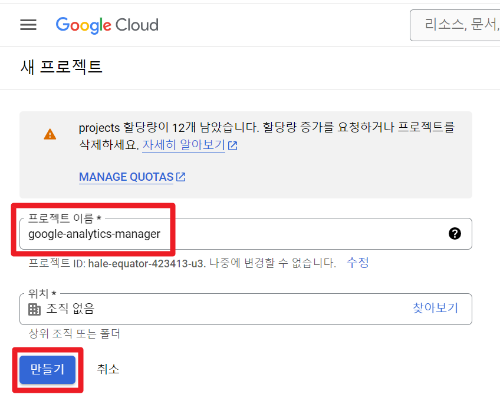

<br/>


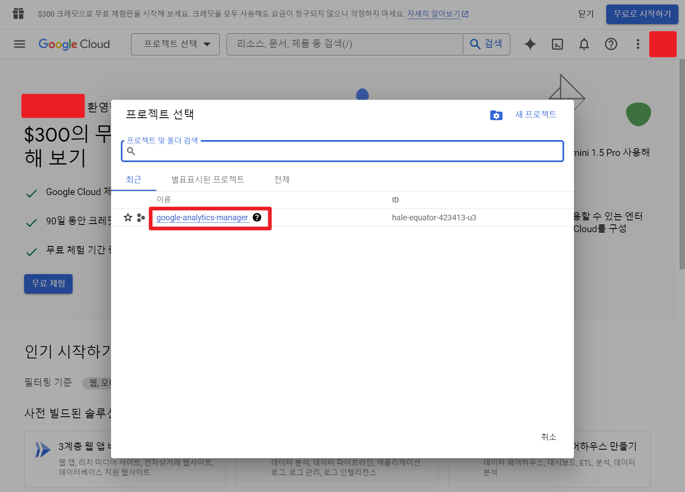

<br/>


<br/>


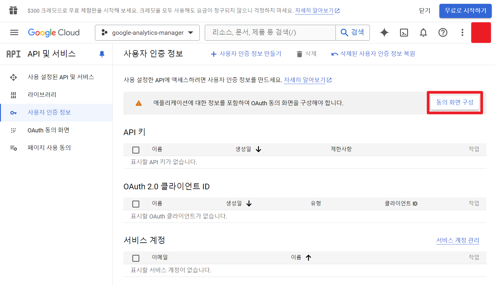

<br/>


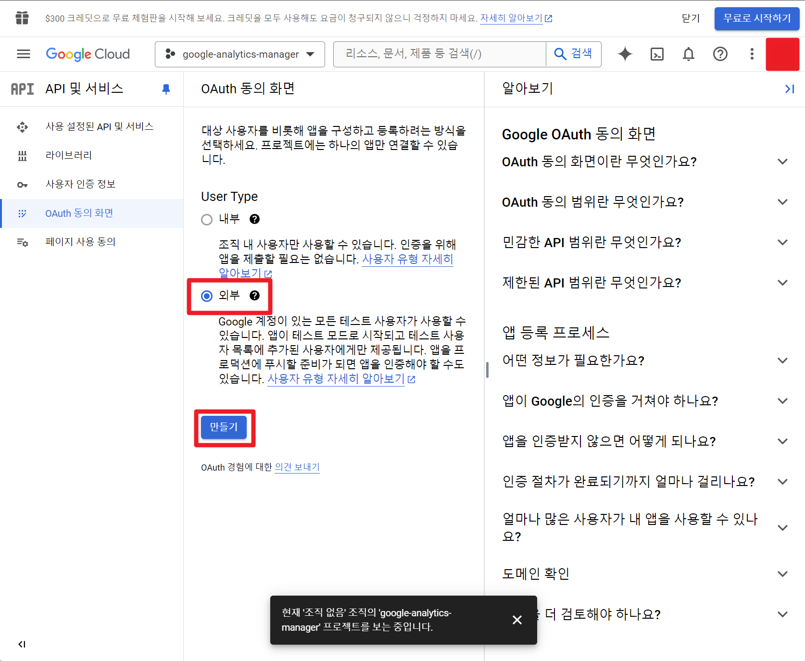

<br/>


앱 이름에는 google 이라는 단어가 들어가면 안됩니다.

google 이라는 단어가 포함되면 에러를 내기에 아래와 같이 analytics-manager 라는 이름으로 지정해주었습니다.

> 참고 : [앱을 저장하는 중에 오류가 발생했습니다. 요청이 악용으로 분류되었으며 진행할 수 없습니다. 해결 방법](https://happy-jjang-a.tistory.com/288)

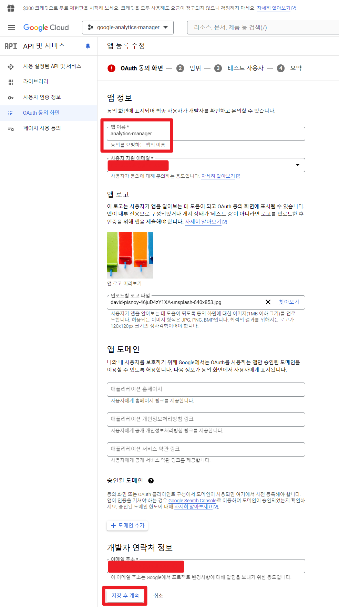

<br/>


<br/>


<br/>


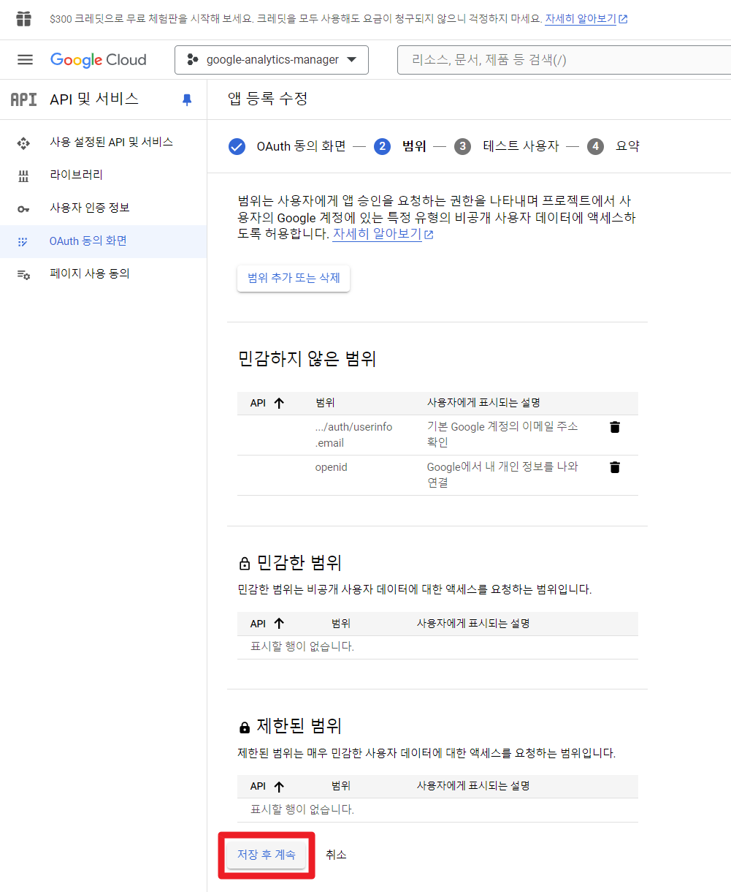

<br/>


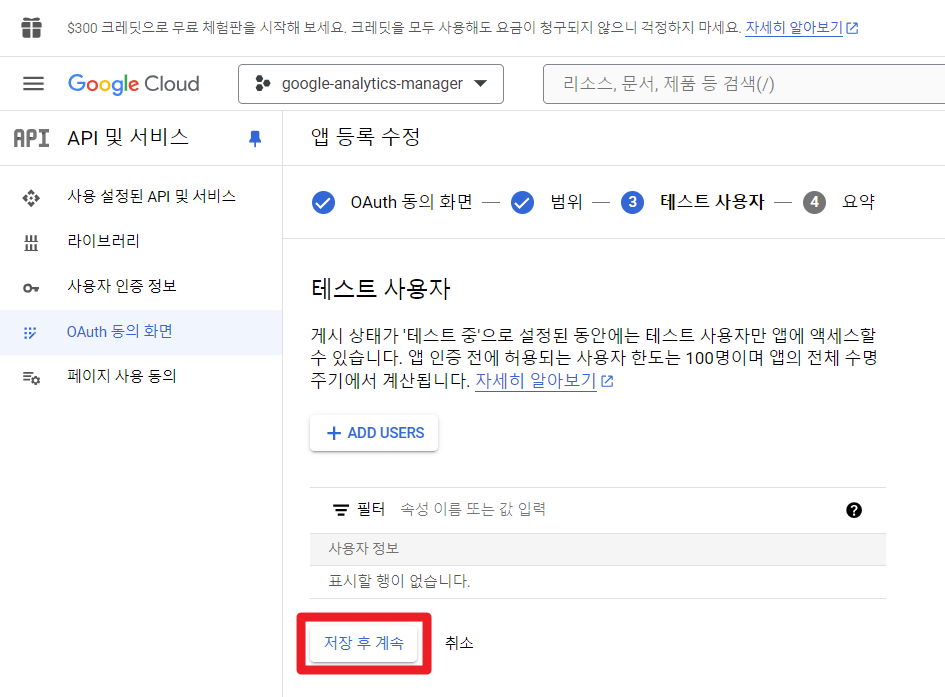

<br/>


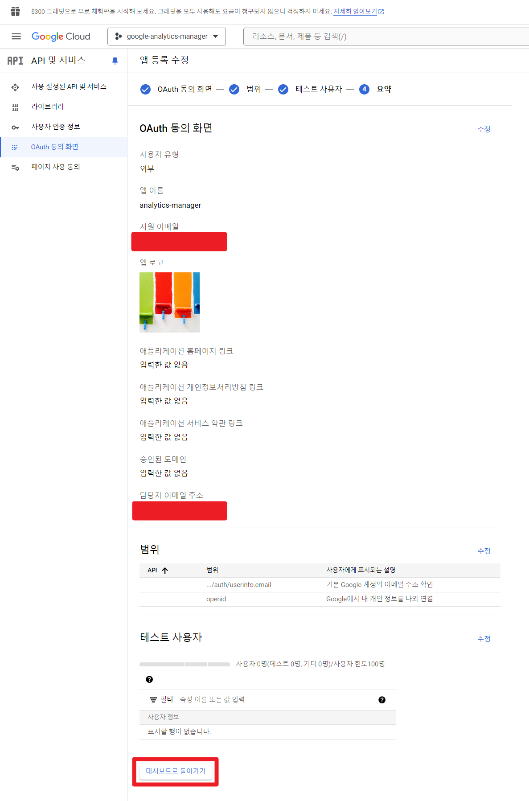

<br/>


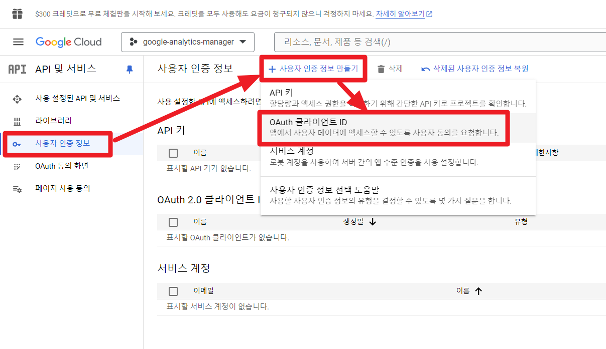

<br/>


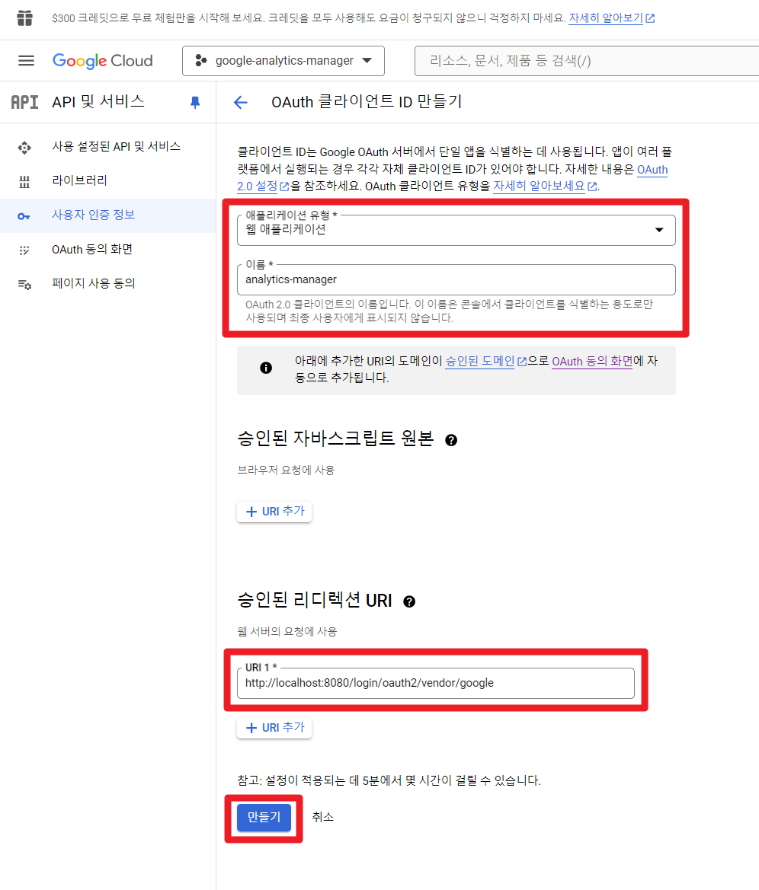

<br/>


<br/>


위에서 클라이언트 ID, 클라이언트 보안 비밀번호는 Spring Security 속성에는 아래와 같이 매칭됩니다.

```yaml
spring:
  # ... 
  security:
    oauth2:
      client:
        registration:
          google:
            client-id: 클라이언트 ID 
            client-secret: 클라이언트 보안 비밀번호
            scope:
              - email
              - profile
# ...
```


