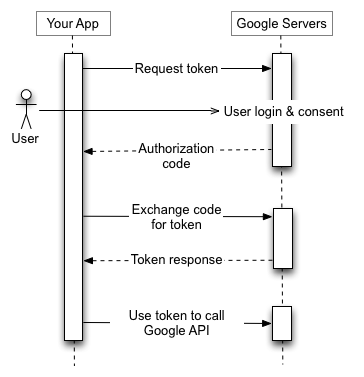
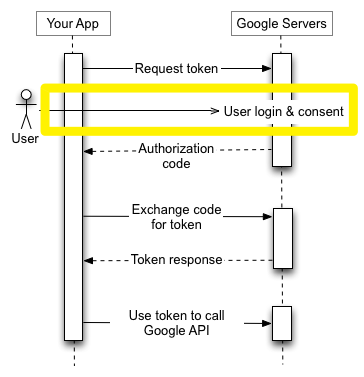

## 구글 로그인 (without oauth2 client)

OAuth2 로그인 기능을 raw 레벨로 로그인하는 방식을 계속 찾아보고 그 결과 어떻게 OAuth2 요청을 수행해야 하는지를 요약해봤습니다.<br/>

제 경우에는 browser 로 접근하는 방식을 어떻게 해결할지에 대해(React 등과 같은 Frontend 코드를 이용) 해결된다면 아마도 OAuth2 login 은 Spring OAuth2 Client 를 사용하지 않고 개인적으로 작성한 코드를 사용하면서 기존 Spring Security 를 그대로 사용하게 될 듯 합니다.<br/>

이렇게 하는 이유는 OAuth2 Client 기능을 그대로 사용했을 때 OAuth2 Client 내부 구현이 바뀌었을 때 대응할 수 있는 대응책이 없는 것 같고, FeignClient 를 잘 활용하고 있기 때문에 Fiegn Client 로 직접 OAuth2 프로세스를 수행하는 과정을 직접 모듈로 구현하는 것이 좋겠다는 판단이 들어서입니다.<br/>


### 참고자료

- [Google Authorization - developers.google.com](https://developers.google.com/identity/protocols/oauth2?hl=ko)
- [스프링부트로 Google 로그인 구현해보기 -2](https://darrenlog.tistory.com/40)
- [구글 로그인 구현하기 3편 - 로그인 구현하기 (Spring Boot + Vue.js)](https://notspoon.tistory.com/47)

<br/>


개인적으로는 Spring OAuth2 Client 를 사용하다가 Feign Client 로 직접 요청하는 방식에 대해서 파악하면서 삽질을 조금 했는데 이 당시 로그인 URL 이 어떻게 되는지를 몰라서 많이 해멨고, 인터넷 자료도 다 제 각각이라서 오히려 시간이 배로 들었던 경험이었습니다. 인터넷 자료가 OAuth2 Client 를 쓰는 자료가 너무 많았고, 그래서 아예 쌩으로 FeignClient 만 사용하는 예제를 찾아봤었습니다.<br/>

그러다가 단순 코드만 보면 좀 파악이 안되어서 아래와 같은 http 요청을 보내봤고

```http
GET https://accounts.google.com/o/oauth2/auth?
    client_id=clientId
    &redirect_uri=http://localhost:8080/welcome
    &response_type=token
    &scope=profile
```

이게 http 파일에서는 안되길래 브라우저에서 입력해봤습니다.<br/>


그랬더니 로그인, OAuth2 동의화면이 잘 떠서 이게 이런이야기구나... 처음에는 브라우저에서 시작해야하는구나 하는 생각을 했습니다.<br/>

위 문제가 해결된 이후로는 운 좋게 아래의 자료를 접했고, 그 이후의 과정에 대해서 자세하게 설명해주셔서 개념파악을 하는 데에 많은 도움이 되었습니다.

- https://darrenlog.tistory.com/40

<br/>


제 경우에는 아마도 React 페이지를 구성해서 axios 요청을 하는 코드는 아래의 자료를 참고하게 될 것 같네요

- https://notspoon.tistory.com/47

<br/>

Vue 를 싫어하는 건 아니지만, 그나마 조금 알고 있는게 React 이기에 SPA 페이지를 만들때는 매번 React 를 선택하네요!!<br/>


### 전반적인 절차



<br/>


### 0) redirect uri

이번 예제에서 사용하는 redirect uri 는 [http://localhost:8080/welcome](http://localhost:8080/welcome) 입니다.<br/>

이 redirect uri 는 [https://cloud.google.com](https://cloud.google.com) 내에서 구글 클라우드 \> 콘솔 메뉴에서 입력한 주소입니다.<br/>

구글 내에서 인증이 모두 완료되면, 구글은 access token 을 파라미터로 해서 우리가 입력한 redirect uri 로 리다이렉트 시켜줍니다.<br/>

그리고 우리는 이 redirect uri 내에서 access token 을 전달 받은 다음에 이 access token 을 헤더에 담아서 [https://www.googleapis.com/oauth2/v2/userinfo](https://www.googleapis.com/oauth2/v2/userinfo) 에 Get 요청을 보내면, 사용자가 OAuth2 화면에서 정보 제공에 동의한 정보들을 전달받게 됩니다.<br/>

 

### 1) browser 에 아래 주소를 입력

- [https://accounts.google.com/o/oauth2/auth?client_id={클라이언트ID}&redirect_uri=http://localhost:8080/welcome&response_type=token&scope=profile](https://accounts.google.com/o/oauth2/auth?client_id={클라이언트ID}&redirect_uri=http://localhost:8080/welcome&response_type=token&scope=profile)<br/>

<br/>

보기좋게 정리하면 아래와 같은 모습입니다.(브라우저에서만 실행 가능해요)

```http
GET https://accounts.google.com/o/oauth2/auth?
    client_id=clientId
    &redirect_uri=http://localhost:8080/welcome
    &response_type=token
    &scope=profile
```

<br/>



<br/>


### 2) browser redirect 된 주소

로그인, 동의 화면 

- [https://accounts.google.com/o/oauth2/auth/oauthchooseaccount?client_id={clientId}&redirect_uri={base64 encoding 된 redirect uri}&response_type=token&scope=profile&service=lso&o2v=1&ddm=0&flowName=GeneralOAuthFlow](https://accounts.google.com/o/oauth2/auth/oauthchooseaccount?client_id={clientId}&redirect_uri={base64 encoding 된 redirect uri}&response_type=token&scope=profile&service=lso&o2v=1&ddm=0&flowName=GeneralOAuthFlow)

<br/>


보기 좋게 정리해보면 아래와 같습니다. (브라우저에서만 동작해요)

```http
GET https://accounts.google.com/o/oauth2/auth/oauthchooseaccount?
	client_id={clientId}
	&redirect_uri={base64 encoding 된 redirect uri}
	&response_type=token
	&scope=profile
	&service=lso
	&o2v=1
	&ddm=0
	&flowName=GeneralOAuthFlow
```

<br/>


<br/>

여기 까지는 아직 위와 같이 첫번째 단계입니다.<br/>

<br/>


### 3) (액세스 토큰) 내 서버의 특정 주소로 리다이렉트

토큰을 얻어오는 과정입니다. 구글 계정은 access token 을 get parameter 에 실어서 아래와 같은 구글 콘솔에 입력한 주소로 리다이렉트 시켜줍니다.<br/>

- [http://localhost:8080/welcome#access_token={액세스 토큰}&token_type=Bearer&expires_in=3599&scope={스코프}](http://localhost:8080/welcome#access_token={액세스 토큰}&token_type=Bearer&expires_in=3599&scope={스코프})

<br/>


이번 과정은 위 그림에서 두번째 과정이며, 응답결과로 토큰을 획득하게 됩니다.<br/>


### 4) (사용자 조회) 사용자가 동의한 OAuth2 정보 조회

- 헤더 : `Authorization : Bearer {액세스토큰}` 을 주어서 아래 주소로 GET 조회합니다.
- GET [https://www.googleapis.com/oauth2/v2/userinfo](https://www.googleapis.com/oauth2/v2/userinfo)


이번 과정은 사용자가 OAuth2 동의 화면에서 정보제공에 동의한 정보를 토큰을 이용해서 조회해오는 세번째 과정입니다.<br/>


#### 참고

응답 바디를 구성하기 쉽지 않은데 초반에는 Map 을 사용하거나, JsonNode 를 사용해서 응답바디가 어떻게 되는지 파악하면 될 것 같습니다.<br/>

참고 : https://darrenlog.tistory.com/40

```java
private JsonNode getUserResource(String accessToken, String registrationId) {
    String resourceUri = env.getProperty("oauth2."+registrationId+".resource-uri");

    HttpHeaders headers = new HttpHeaders();
    headers.set("Authorization", "Bearer " + accessToken);
    HttpEntity entity = new HttpEntity(headers);
    return restTemplate.exchange(resourceUri, HttpMethod.GET, entity, JsonNode.class).getBody();
}
```

<br/>


