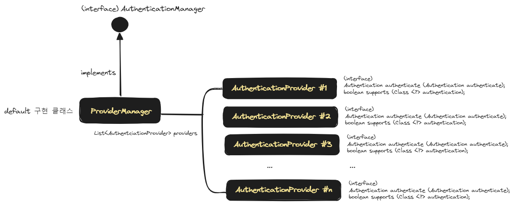

## 시큐리티 인증 클래스들의 상호작용

## AuthenticationManager, AuthenticationProvider, ProviderManager




`ProviderManager` 는 AuthenticationProvider 인스턴스들을 List 형태로 가지고있으면서 관리하는 객체입니다. 즉 Provider 들을 Manage 하는 객체입니다. 이 `ProviderManager` 는 `AuthenticationManager` 인터페이스를 구현한 기본 구현체입니다.<br/>


## AuthenticationManagerResolver

AuthenticationManager 를 기본 구현한 클래스는 ProviderManager 이고 스프링에서 기본으로 제공하지만, 여러가지 종류의 AuthenticationManager 를 구현해서 사용하고 싶을 수 있습니다. 인증 로직이 복잡해질 수록 한군데에 하드코딩한 로직들은 점점 갈 수록 장애를 내게 될 확률이 높기에 시기 적절하게 항상 기능별로 모듈화를 해두는 것이 좋습니다. 따라서 용도별로 AuthenticationManager 를 분리해서 정의하는 경우가 많습니다.<br/>

이렇게 용도별로 분리해둔 AuthenticationManager 들 중에서 Filter 가 어떤 AuthenticationManager 를 사용할지 결정할 수 있도록 하는 역할을 하는 것이 `AuthenticationManagerResolver` 입니다. 말 그대로 `AuthenticationManager` 를 resolve 하는 역할을 수행합니다.<br/>

<br/>


예를 들어 아래와 같은 시큐리티 클래스가 있다고 해보겠습니다.

```java
@Configuration
public class SucurityConfig {
    // ...
}
```

<br/>


그리고 `customerAuthenticationManager` 라는 이름의 Bean 을 아래와 같이 생성한다고 해보겠습니다. 예제이기에 간단하게 인라인 형식으로 단순하게 만들었습니다.

```java
@Bean
AuthenticationManager customersAuthenticationManager() {
    return authentication -> {
        if (isCustomer(authentication)) {
            return new UsernamePasswordAuthenticationToken(/*credentials*/);
        }
        throw new UsernameNotFoundException(/*principal name*/);
    };
}
```

<br/>


이번에는 `employeesAuthenticationManager` 라는 이름의 Bean 을 아래와 같이 생성해봅니다. 예제 수준의 단순한 인라인 정 코드입니다.

```java
@Bean
public AuthenticationManager employeesAuthenticationManager() {
    return authentication -> {
        if (isEmployee(authentication)) {
            return new UsernamePasswordAuthenticationToken(/*credentials*/);
        }
        throw new UsernameNotFoundException(/*principal name*/);
    };
}
```

<br/>


이렇게 정의해둔 `AuthenticationManager` 들은 어떤 기준에 의해 선택이 될수 있어야 합니다. `AuthenticationManagerResolver` 에는 이런 AuthenticationManager 들을 특정 기준에 의해 선택하는 코드를 작성합니다.

```java
AuthenticationManagerResolver<HttpServletRequest> resolver() {
    return request -> {
        if (request.getPathInfo().startsWith("/employee")) {
            return employeesAuthenticationManager();
        }
        return customersAuthenticationManager();
    };
}
```

<br/>


## ReactiveAuthenticationManagerResolver

이번에는 위에서 살펴본 `AuthenticationManager` 를 Reactive 버전으로 작성해봅니다.<br/>


예를 들어 아래와 같은 시큐리티 클래스가 있다고 해보겠습니다. 아까와 달라진 점은 `@EnableWebFluxSecurity`, `@EnableReactiveMethodSecurity` 을 추가해줬다는 점입니다.

```java
@EnableWebFluxSecurity
@EnableReactiveMethodSecurity
public class SucurityConfig {
    // ...
}
```

<br/>


그리고 `customerAuthenticationManager` 라는 이름의 Bean 을 아래와 같이 생성한다고 해보겠습니다. 예제이기에 간단하게 인라인 형식으로 단순하게 만들었습니다. 아까와 달라진 점은 `ReactiveAuthenticationManager` 를 반환한다는 점입니다.

```java
@Bean
public ReactiveAuthenticationManager customersAuthenticationManager() {
    return authentication -> {
        if (isCustomer(authentication)) {
            return new UsernamePasswordAuthenticationToken(/*credentials*/);
        }
        throw new UsernameNotFoundException(/*principal name*/);
    };
}
```

<br/>


이번에는 `employeesAuthenticationManager` 라는 이름의 Bean 을 아래와 같이 생성해봅니다. 예제 수준의 단순한 인라인 코드입니다. 아까와 달라진 점은 `ReactiveAuthenticationManager` 를 반환한다는 점입니다.

```java
@Bean
public ReactiveAuthenticationManager employeesAuthenticationManager() {
    return authentication -> {
        if (isEmployee(authentication)) {
            return new UsernamePasswordAuthenticationToken(/*credentials*/);
        }
        throw new UsernameNotFoundException(/*principal name*/);
    };
}
```

<br/>


이렇게 정의한 ReactiveAuthenticationManager 들은 아래와 같이 ReactiveAuthenticationManagerResolver 에서 적절한 ReactiveAuthenticationManager 를 선택하도록 정의하는 것이 가능합니다.

```java
ReactiveAuthenticationManagerResolver<ServerWebExchange> resolver() {
    return exchange -> {
        if (match(exchange.getRequest(), "/employee")) {
            return Mono.just(employeesAuthenticationManager());
        }
        return Mono.just(customersAuthenticationManager());
    };
}
```

<br/>


## `foobar-user` 는?

제가 작성한 `foobar-user` 에서는 ReactiveAuthenticationManagerResolver 까지 사용하지는 않았고 1개의 ReactiveAuthenticationManager를 Filter 에 등록해서 사용하는 방식으로 아래와 같이 사용했습니다.

```java
@RequiredArgsConstructor
@EnableWebFluxSecurity
@EnableReactiveMethodSecurity
@Configuration
public class SecurityConfig {

  @Bean
  public SecurityWebFilterChain filterChain(
      ServerHttpSecurity httpSecurity,
      JwtServerAuthenticationConverter converter,
      JwtAuthenticationManager authenticationManager
  ){
    // (1)
    var authenticationWebFilter = new AuthenticationWebFilter(authenticationManager);
    authenticationWebFilter.setServerAuthenticationConverter(converter);

    return httpSecurity
        // ...
        .csrf(csrfSpec -> csrfSpec.disable())
        .formLogin(formLoginSpec -> formLoginSpec.disable())
        .httpBasic(httpBasicSpec -> httpBasicSpec.disable())
        // ...
        .addFilterAt(authenticationWebFilter, SecurityWebFiltersOrder.AUTHENTICATION)
        .build();
  }
}
```


(1)

- AuthenticationWebFilter 객체 생성시에 JwtAuthenticationManager 를 전달해줍니다. 
- JwtAuthenticationManager 의 내용은 아래에 정리해두었습니다.

<br/>


아래는 JwtAuthenticationManager 클래스의 내용입니다. 이 코드에 대한 자세한 설명은 [AuthenticationManager방식의 JWT 인증 # JwtAuthenticationManager 문서](https://chagchagchag.github.io/docs-webflux-spring-security/jwt-authentication-manager-way/example-using-reactive-authentication-manager/#jwtauthenticationmanager) 에 정리해두었습니다.

```java
package io.chagchagchag.example.foobar.user.config.security;

// ...

@RequiredArgsConstructor
@Component
public class JwtAuthenticationManager implements ReactiveAuthenticationManager {
  private final JwtSupport jwtSupport;
  private final CustomUserDetailsService userDetailsService;

  @Override
  public Mono<Authentication> authenticate(Authentication authentication) {
    return Mono.justOrEmpty(authentication)
        .filter(auth -> auth instanceof BearerToken)
        .cast(BearerToken.class)
        .map(bearerToken -> degenerateToken(bearerToken))
        .flatMap(jwtDto -> validateJwt(jwtDto))
        .flatMap(jwtDto -> findUserById(jwtDto.id()))
        .onErrorMap(throwable -> new IllegalArgumentException("INVALID JWT"));
  }

  public JwtDto degenerateToken(BearerToken token){
    return jwtSupport.degenerateToken(SecurityProperties.key, token.getJwt());
  }

  public Mono<JwtDto> validateJwt(JwtDto jwtDto){
    if(jwtSupport.checkIfNotExpired(jwtDto.expiration())){
      return Mono.just(jwtDto);
    }
    return Mono.error(new IllegalArgumentException("Token Invalid"));
  }

  private Mono<Authentication> findUserById(String userId){
    return userDetailsService
        .findByUsername(userId)
        .map(userDetails -> {
          var authentication = new UsernamePasswordAuthenticationToken(
              userDetails.getUsername(), userDetails.getPassword(), userDetails.getAuthorities()
          );
          SecurityContextHolder.getContext().setAuthentication(authentication);
          return authentication;
        });
  }
  
}
```


