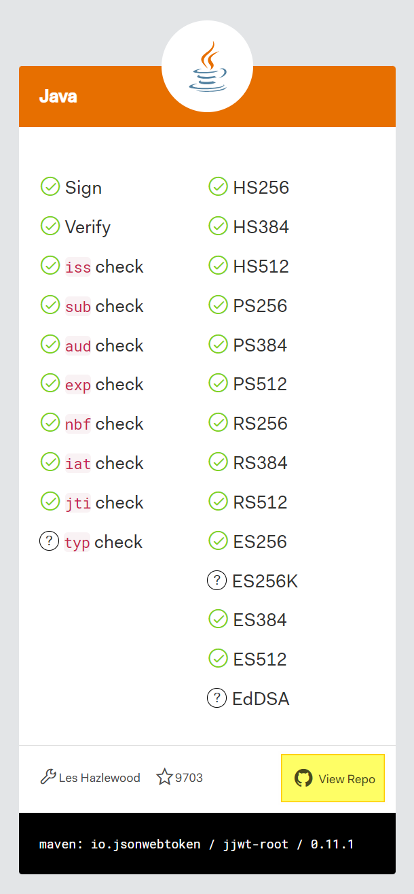
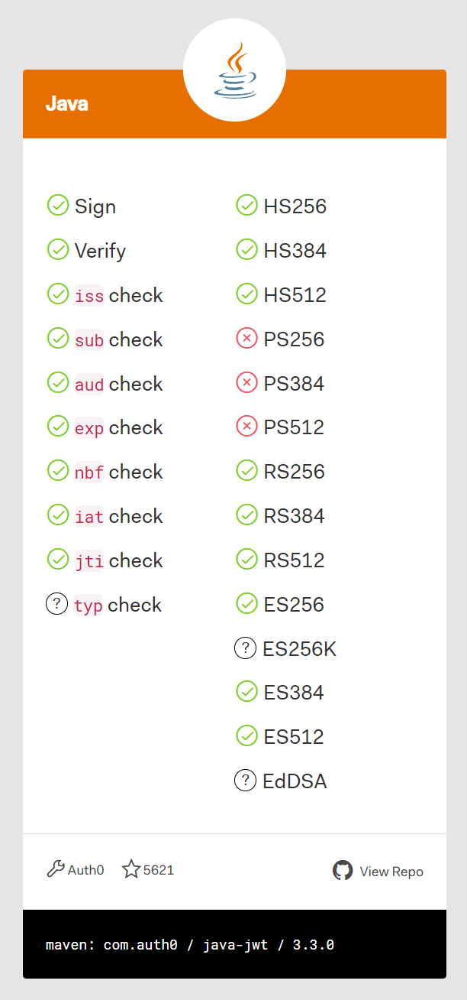
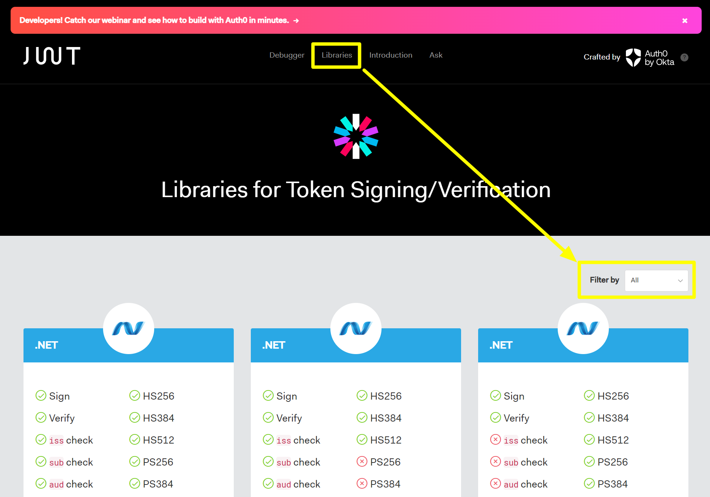

## JWT 생성, 분해

이번 문서에서는 Java 기반으로 JWT 를 생성하고 분해하는 예제를 살펴봅니다.<br/>


## 의존성 추가

jjwt-api, jjwt-impl 등의 라이브러리는 [github.com/jwtk/jjwt](https://github.com/jwtk/jjwt) 에서 제공하는 라이브러리입니다.

```groovy
dependencies {
    // ...    
	implementation 'io.jsonwebtoken:jjwt-api:0.11.2'
	implementation 'io.jsonwebtoken:jjwt-impl:0.11.2'
	implementation 'io.jsonwebtoken:jjwt-jackson:0.11.2'
    // ...
}
```

<br/>

Java 기반의 JWT 라이브러리를 선택하는 것은 [jwt.io/libraries?language=java](https://jwt.io/libraries?language=Java) 에서 확인 가능합니다. 저의 경우에는 `io.jsonwebtoken` 에서 제공하는 라이브러리를 선호하기 때문에 io.jsonwebtoken 계열의 라이브러리를 선택했습니다. 캡쳐에서 보이듯 지원되는 알고리즘이 많은 것을 확인 가능합니다. 하단의 `View Repo` 버튼을 클릭하면 Github Repository 로 이동합니다.<br/>



<br/>


[jwt.io/libraries?language=java](https://jwt.io/libraries?language=Java) 페이지에서 가장 최상단에 나타나는 라이브러리가 지원되는 알고리즘이 많은 것은 아닙니다. 예를 들어 가장 최상단에 나타난 `com.auth0` 에서 제공하는 JWT 라이브러리는 일부 알고리즘이 지원되지 않음을 확인 가능합니다. 꼭 지원되는 알고리즘을 확인하시고 라이브러리를 선택하시기를 바랍니다.



<br/>


## 언어별로 지원되는 JWT 라이브러리 확인 

jwt.io 에서는 Libraries 탭을 클릭하면 [https://jwt.io/libraries](https://jwt.io/libraries) 로 이동됩니다. 여기서 모든 언어에서 지원되는 JWT 라이브러리들이 리스팅 되어서 보여지고 `Filter by` 메뉴에서 원하는 언어를 클릭해서 원하는 언어에서 지원되는 JWT 공식 라이브러리들과 지원되는 알고리즘들을 확인하실 수 있습니다.



<br/>


## Secret 정의, HS256 기반의 Key 생성

Secret 으로 사용할 문자열을 정의하고 이 문자열을 HS256 기반의 알고리즘으로 Key 를 생성합니다.

저의 경우는 `SecurityProperties.java` 라는 별도의 클래스에 Key, Secret 을 정의해두었습니다.

```java
public class SecurityProperties {
  public static final String SECRET = "abcdefghijklmnopqrstuvwxyzABCDEFGHIJKLMLOPQRTTTTTTTTT";
  public static final Key key = Keys.hmacShaKeyFor(SECRET.getBytes(StandardCharsets.UTF_8));
}
```

<br/>


## JWT 생성, 분해 

JWT 생성, 분해를 하는 코드는 아래와 같습니다. 간단한 테스트 코드를 통해 확인해봅니다.

```java
// ...

public class JwtSupportTest {
  // ...

  @DisplayName("JWT_생성_분해_테스트")
  @Test
  public void TEST_JWT_생성_분해_테스트(){
    // (1)
    // given
    String username = "John Deer";
    String userId = "jdman";
    Key key = SecurityProperties.key;

    // (2)
    // when
    // JWT 생성
    String jwt = Jwts.builder()
      .setSubject(username)
      .setExpiration(new Date(System.currentTimeMillis() + 864000000))
      .claim("id", userId)
      .claim("username", username)
      .signWith(key, SignatureAlgorithm.HS256)
      .compact();

    // then
    // JWT 분해
    JwtParser parser = Jwts.parserBuilder()
        .setSigningKey(key)
        .build();

    Jws<Claims> claimsJws = parser.parseClaimsJws(jwt);

    assert claimsJws.getBody().get("id", String.class).equals(userId);
    assert claimsJws.getBody().get("username", String.class).equals(username);
  }
  
}
```

<br/>

(1)<br/>

`John Deer` 라는 이름과 `jdman` 이라는 userId 에 대해서 Key를 기반으로 JWT를 생성합니다. JWT는 하나의 문자열 토큰입니다. Key 는 위에서 설명했듯 SecurityProperties 라는 클래스에서 특정 문자열 시크릿을 static 하게 HS256 기반의 알고리즘으로 생성해둔 Key 입니다.<br/>


(2)<br/>

JWT 문자열을 생성 시에는 Key 를 기반으로 서명을 생성합니다. 그리고 Jwt에 필수적으로 저장할 claim 들은 id 로 지정했습니다.<br/>

<br/>


(3)<br/>

생성한 JWT 문자열에서 id, username 등과 같은 정보를 추출해냅니다.<br/>

<br/>


## 컴포넌트로 정의

제 경우에는 위의 코드들을 하나의 컴포넌트로 생성했고, 스프링 컨테이너에서 객체를 생성해서 관리하도록 해두었습니다.<br/>

```java
package io.chagchagchag.example.foobar.core.user.jwt;

import io.jsonwebtoken.Claims;
import io.jsonwebtoken.Jws;
import io.jsonwebtoken.JwtParser;
import io.jsonwebtoken.Jwts;
import io.jsonwebtoken.SignatureAlgorithm;
import java.security.Key;
import java.util.Date;
import org.springframework.http.server.reactive.ServerHttpResponse;
import org.springframework.stereotype.Component;

@Component
public class JwtSupport {
  public String generateToken(Key key, String userId, String username){
    return Jwts.builder()
        .setSubject(username)
        .setExpiration(new Date(System.currentTimeMillis() + 864000000))
        .claim("id", userId)
        .claim("username", username)
        .signWith(key, SignatureAlgorithm.HS256)
        .compact();
  }

  public void addJwtAtResponseHeader(String jwt, ServerHttpResponse response){
    response.getHeaders().add("Authorization", String.format("Bearer %s", jwt));
  }

  public JwtDto degenerateToken(Key key, String token){
    JwtParser parser = Jwts.parserBuilder()
        .setSigningKey(key)
        .build();

    Jws<Claims> claimsJws = parser.parseClaimsJws(token);

    return new JwtDto(
        claimsJws.getBody().get("id", String.class),
        claimsJws.getBody().get("username", String.class),
        claimsJws.getBody().getExpiration()
    );
  }

  public Boolean checkContainsBearer(String header){
    var len = "Bearer ".length();
    return header.substring(0, len).equalsIgnoreCase("Bearer");
  }

  // 만료되면 true
  // 만료되지 않았으면 false
  public Boolean checkIfNotExpired(Date expiration){
    return expiration.after(new Date());
  }
}
```

