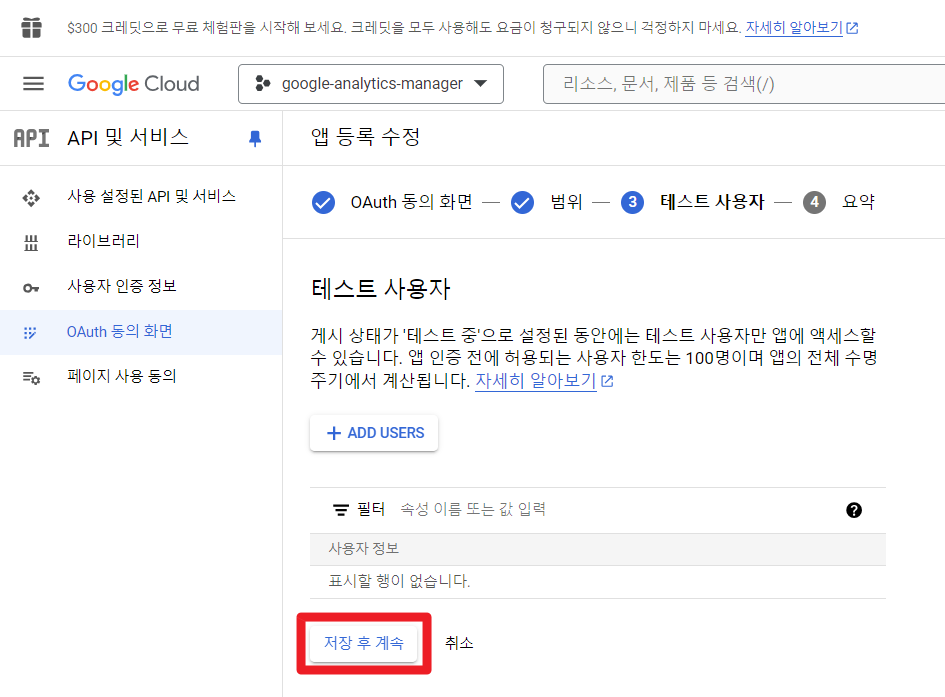
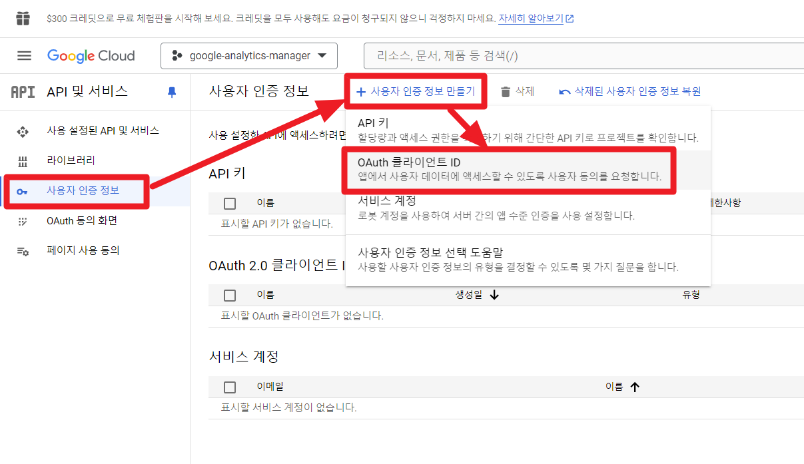

## 구글 클라우드 앱 토큰 생성

> 주의
>
> - 앱 이름에는 'google' 이라는 단어가 들어가면 안됩니다.
>
>   앱 이름에 'google' 이라는 단어가 포함되면 에러를 내기에 아래 예제문서에서는 'analytics-manager' 라는 이름으로 지정해주었습니다.
>
> - 참고 : [앱을 저장하는 중에 오류가 발생했습니다. 요청이 악용으로 분류되었으며 진행할 수 없습니다. 해결 방법](https://happy-jjang-a.tistory.com/288)
>
> - 이번 설명 문서에서는 프로젝트 명에 'google' 이라는 단어를 포함했지만, 나중에 혼동을 방지하고 싶다면 가급적이면 프로젝트 명도 'google' 단어를 포함하지 않는 것을 추천합니다.


https://cloud.google.com/?hl=ko 에 접속합니다.


<br/>


로그인하면 아래와 같은 팝업이 나타납니다. (또는 무료로 시작하기 버튼을 누르면 아래 팝업이 페이지로 나타납니다.)


<br/>


프로젝트 선택 → 새 프로젝트 


<br/>


프로젝트 명을 입력합니다. 그리고 만들기 버튼을 클릭하세요.


<br/>


방금 만든 `google-analytics-manager`  프로젝트를 선택합니다.


<br/>


API 및 서비스 → 사용자 인증 정보 를 클릭합니다.


<br/>


동의화면 구성 버튼을 클릭합니다.


<br/>


UserType 은 "외부"를 선택해서 만들기를 클릭합니다.


<br/>


앱 이름에는 google 이라는 단어가 들어가면 안됩니다.

google 이라는 단어가 포함되면 에러를 내기에 아래와 같이 analytics-manager 라는 이름으로 지정해주었습니다.

> 참고 : [앱을 저장하는 중에 오류가 발생했습니다. 요청이 악용으로 분류되었으며 진행할 수 없습니다. 해결 방법](https://happy-jjang-a.tistory.com/288)


<br/>


범위 추가 또는 삭제 버튼을 클릭합니다.


<br/>


스코프를 선택합니다. 가장 최소한도의 범위인 email, openid 만 선택했습니다. 그리고 업데이트 버튼을 클릭합니다. 


<br/>


선택한 내용을 확인하는 화면인데, "저장 후 계속" 버튼을 클릭해서 다음 페이지로 이동합니다.


<br/>


테스트 사용자 화면입니다. 아직 테스트 사용자를 추가하지 않을 것이기에 아무것도 하지 않고 "저장 후 계속" 을 클릭합니다.



<br/>


OAuth 동의화면이 나타납니다.


<br/>


사용자 인증 정보 → 사용자 인증 정보 만들기 → OAuth 클라이언트 ID 를 선택합니다.



<br/>

아래와 같이 선택하고 '만들기'버튼을 클릭하시면 됩니다.

애플리케이션 유형

- 웹 애플리케이션

이름

- 원하는 애플리케이션 명 입력

승인된 리디렉션 URI

- http://localhost:8080/login/oauth2/code/google 로 지정해줬습니다. (x 표는 예전에 잘못입력했었던 정보입니다.)


<br/>

생성된 OAuth 클라이언트는 다운로드 받을 수 있습니다. 꼭 다운로드 받아서 안전한 위치에 보관해주시기 바랍니다.


<br/>


위에서 클라이언트 ID, 클라이언트 보안 비밀번호는 Spring Security 속성에는 아래와 같이 매칭됩니다.

```yaml
spring:
  # ... 
  security:
    oauth2:
      client:
        registration:
          google:
            client-id: 클라이언트 ID 
            client-secret: 클라이언트 보안 비밀번호
            scope:
              - email
              - profile
# ...
```


